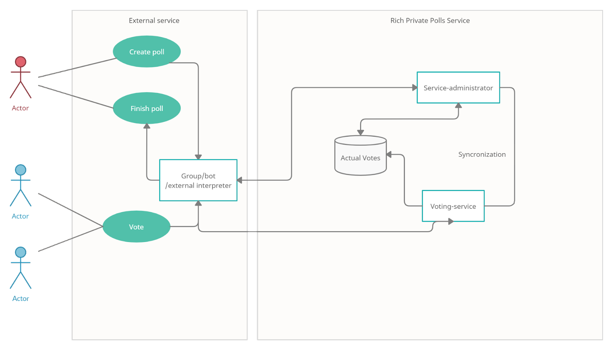

##Предполагаемая ЦА
Пользователи мессенджеров, соцсетей и иных сервисов, которых не удовлетворяет функционал данных сервисов в области опросов.

##Разбиение ЦА
+ Соцсети
+ Мессенджеры
+ Пользователи-компании (использование во внутренних приложениях организаций)

##Use cases для каждой группы ЦА

##User story:
+ Как организатор опроса я хочу быстро и понятно уметь создавать опрос.
+ Как организатор опроса я хочу получить понятную интерпретацию результатов.
+ Как участник опроса я хочу видеть возможные варианты ответа, а также конфигурацию опроса.
+ Как участник опроса я хочу поучаствовать в опросе
+ Как организатор беседы/чата, я хочу знать о проходящих опросах/получать результаты.
+ Как организация, я хочу возможность сохранения/экспорта результатов опроса.

##Job story:
+ Когда мне неравнозначны варианты кроме лучшего, я хочу выразить все свои приоритеты, чтобы мои предпочтения влияли на результат
+ Когда я не уверен наверняка, я хочу расставить вариантам вероятности, чтобы было видно, к чему и насколько я склоняюсь
+ Когда мне нужен обычный опрос, я хочу простой интерфейс, чтобы его провести

